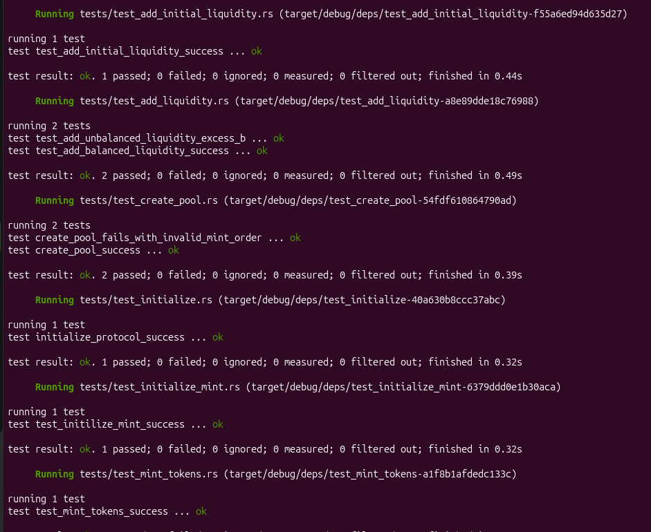
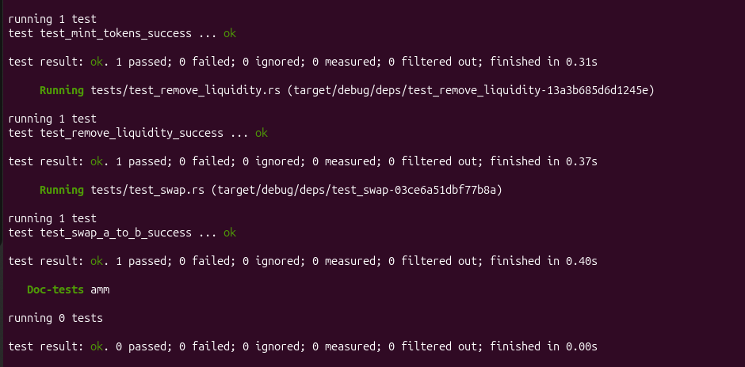
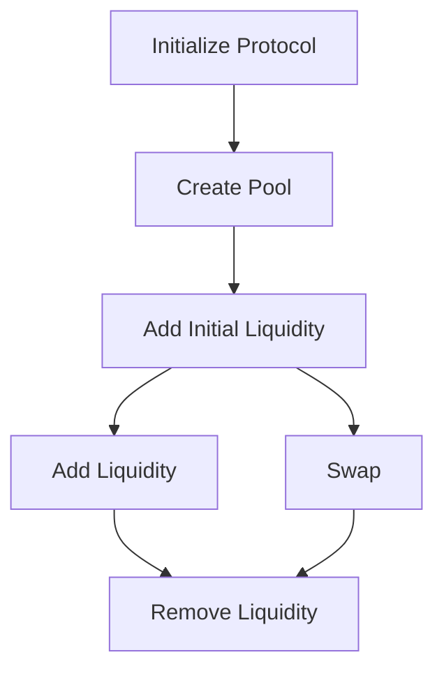

# Solana Constant-Product AMM

An automated market maker built with Anchor on Solana. The program implements a constant-product curve directly in Rust, supports liquidity provision and bidirectional token swaps, and includes protocol fees, treasury collection, deadlines, slippage protection, emergency pause controls, two-step administration, minimum locked liquidity, events, and LiteSVM integration tests.

This project was originally built before the Turbin3 Q3 Builders cohort and is submitted for the Week 3 AMM assignment.

## Assignment Coverage

| Requirement | Implementation |
| --- | --- |
| Write an AMM program | Pool creation, initial liquidity, subsequent liquidity additions, swaps, and liquidity removal |
| Add fees and a treasury account | Configurable swap and treasury fees, with protocol fees routed to treasury token accounts |
| Test all instructions | Rust integration tests using LiteSVM |
| Implement a CPMM without a library | Constant-product, LP-minting, withdrawal, fee, and rounding calculations are implemented directly in Rust |
| Reason about downtime mitigation | See [Downtime and Resilience](#downtime-and-resilience) |

## Assignment Test Suite

The screenshots below capture the original assignment baseline. The production-hardening suite adds authorization, pause, deadline, reverse-swap, rounding, boundary, and invariant tests.





## Features

- Permissionless creation of pools for two distinct SPL-token mints
- Canonical mint ordering to prevent duplicate reversed pools
- Pool PDA as the authority for token vaults and the LP mint
- Initial and subsequent liquidity provision
- Proportional LP-token minting and burning
- Bidirectional swaps using the constant-product invariant
- Swap fees shared between liquidity providers and the protocol treasury
- Slippage protection for swaps, deposits, and withdrawals
- Deadlines for every price-sensitive user operation
- Emergency pause for pool creation, deposits, and swaps while preserving withdrawals
- Admin-only fee and pause controls
- Two-step admin transfer with cancellation
- On-chain post-swap constant-product validation
- Explicit floor-rounding and dust policy
- Minimum locked LP liquidity
- Events for pool operations and governance changes
- Rust integration tests using LiteSVM

## Program Instructions

### `initialize_protocol`

Initializes the protocol configuration with the administrator, swap-fee rate, treasury-fee rate, treasury authority, pause state, and PDA bump. Governance cannot configure a swap fee above 10%, and the treasury fee cannot exceed the total swap fee.

### `create_pool`

Creates a pool for a canonically ordered pair of token mints. It initializes:

- The pool PDA
- Token A and Token B vaults
- The LP-token mint
- Treasury token accounts for collecting protocol fees

The two mints must be different, and `mint_a < mint_b` is enforced so that the same pair cannot be created again with its mints reversed. Treasury token accounts are reused safely when multiple pools share a mint.

### `add_initial_liquidity`

Deposits the first reserves, establishes the initial pool price, and mints the first LP tokens. A small minimum amount of LP liquidity is permanently locked so that the LP supply cannot return to zero while the pool remains active. `min_lp_out` and `deadline` protect the provider, and both vaults must be empty before initialization so a direct token donation cannot distort the initial ownership calculation.

### `add_liquidity`

Accepts maximum Token A and Token B amounts, calculates the balanced deposit at the pool's current reserve ratio, and leaves any excess tokens with the provider. LP tokens are minted proportionally to the provider's contribution. The transaction fails if the result is below `min_lp_out` or after `deadline`.

### `swap`

Swaps Token A for Token B or Token B for Token A. The instruction:

1. Selects the input and output reserves from the swap direction.
2. Calculates the total fee and protocol-treasury share.
3. Applies the constant-product formula using the effective input.
4. Enforces the user's minimum output and deadline.
5. Calculates the expected post-swap reserves and verifies that `k` cannot decrease.
6. Transfers the input, treasury fee, and output tokens atomically.

### `remove_liquidity`

Burns LP tokens and returns the provider's proportional share of both reserves. The provider supplies minimum acceptable Token A and Token B outputs for slippage protection plus a deadline. Withdrawals remain available during a protocol pause so liquidity providers retain an exit path.

### Administrative instructions

| Instruction | Authority and effect |
| --- | --- |
| `set_paused` | Current admin pauses or resumes pool creation, deposits, and swaps |
| `update_fees` | Current admin updates validated swap and treasury fee rates while the protocol is paused |
| `propose_admin` | Current admin nominates a non-default replacement |
| `accept_admin` | Pending admin signs to accept responsibility |
| `cancel_admin_transfer` | Current admin cancels an outstanding nomination |

### Test utilities

`initialize_mint` and `mint_tokens` are utility instructions used to create deterministic token mints and balances for local integration tests. They are not part of the core AMM flow.

## Architecture

| Account | Purpose |
| --- | --- |
| Protocol Config PDA | Stores protocol administration, fee configuration, treasury, pause state, and bump |
| Pool PDA | Stores the canonical mint pair, vault addresses, LP mint, and pool bump; signs pool-authorized CPIs |
| Token A Vault | Holds the pool's Token A reserve |
| Token B Vault | Holds the pool's Token B reserve |
| LP Mint | Represents proportional ownership of the pool; its mint authority is the Pool PDA |
| Treasury token accounts | Receive the protocol share of swap fees |
| Provider token accounts | Supply liquidity and receive withdrawn assets |
| Provider LP account | Receives LP tokens and supplies them when liquidity is removed |

The program never trusts a client-supplied quote as the authoritative result. It derives the relevant pool state, validates the supplied accounts, recalculates the financial result on-chain, and uses the client's minimum-output arguments only as execution limits.

## Constant-Product Mathematics

The AMM uses the constant-product invariant:

```text
x * y = k
```

where `x` and `y` are the two token reserves and `k` is their product.

All calculations use integer token base units. The curve and LP calculations are implemented directly in Rust rather than delegated to an AMM math library, and larger intermediate integer types are used for multiplication and division.

### Initial liquidity

The initial LP supply is derived from the geometric mean of the two deposits:

```text
initial_lp = floor(sqrt(amount_a * amount_b))
```

`MINIMUM_LIQUIDITY` is locked, and the initial provider receives the remainder:

```text
provider_lp = initial_lp - MINIMUM_LIQUIDITY
```

### Subsequent liquidity

Deposits must preserve the existing reserve ratio:

```text
amount_b_for_a = max_amount_a * reserve_b / reserve_a
amount_a_for_b = max_amount_b * reserve_a / reserve_b
```

The program selects the balanced pair that fits within both maximum amounts. LP tokens are then calculated proportionally:

```text
lp_from_a = actual_amount_a * total_lp_supply / reserve_a
lp_from_b = actual_amount_b * total_lp_supply / reserve_b
lp_minted = min(lp_from_a, lp_from_b)
```

Any unused amount remains in the provider's token account.

### Swap calculation

For an input amount and fee-adjusted effective input:

```text
total_fee       = amount_in * swap_fee_bps / 10_000
treasury_fee    = amount_in * treasury_fee_bps / 10_000
lp_fee          = total_fee - treasury_fee
effective_input = amount_in - total_fee

amount_out = reserve_out * effective_input
             / (reserve_in + effective_input)
```

The treasury share is routed to the protocol treasury. The LP share remains in the pool, increasing the value represented by LP tokens.

The user-provided `min_amount_out` protects the swap against an unacceptable price movement between quote creation and on-chain execution.

### Liquidity removal

Withdrawal amounts are proportional to the LP tokens burned:

```text
amount_a = lp_amount * reserve_a / total_lp_supply
amount_b = lp_amount * reserve_b / total_lp_supply
```

The operation succeeds only when both results meet the provider's minimum requested outputs.

## Safety Properties

- A pool cannot use the same mint for both assets.
- Canonical mint ordering prevents reversed duplicates.
- Vaults and the LP mint are tied to the correct Pool PDA.
- Only the Pool PDA can authorize reserve withdrawals and LP minting.
- Users authorize transfers from their own token accounts.
- Swap, deposit, and withdrawal results are recalculated on-chain.
- Slippage limits protect users from stale quotes and front-running price changes.
- Deadlines prevent a signed instruction from executing after the user's quote-validity window.
- Pause and fee changes require the current administrator.
- Fee changes require a paused protocol so quotes cannot race a live configuration transition.
- Administration cannot change in one step; the nominated key must explicitly accept.
- Initial vaults must be empty before LP ownership is established.
- Minimum locked liquidity prevents the active LP supply from reaching zero.
- Integer calculations use deliberate floor rounding: an unrepresentable fractional fee is not charged, while output and withdrawal remainders stay in the pool.
- Tiny valid swaps may therefore pay zero fee in token base units; this behavior is explicit and tested.
- Residual withdrawal dust continues backing the permanently locked LP position.
- Larger intermediate integer arithmetic reduces overflow risk in multiplication-heavy calculations.
- The post-swap invariant is enforced on-chain so a successful swap cannot improperly reduce `k`.

## Downtime and Resilience

An on-chain Solana program does not run as a continuously hosted server, but users can still experience downtime through RPC failures, network congestion, unavailable frontends, indexer failures, account contention, unsafe upgrades, or a program defect. A production deployment would mitigate these risks at several layers.

### RPC and transaction submission

- Configure multiple RPC providers and switch when health checks detect an unhealthy endpoint.
- Record every submitted transaction signature.
- If submission or confirmation times out, query the signature status and resulting account state before retrying.
- Rebuild an expired transaction with a fresh blockhash and a new pool quote only after establishing that the original transaction did not land.
- Never blindly submit a second swap when the first result is unknown.

### On-chain safety and recovery

- Use the protocol pause mechanism to contain a critical incident.
- Keep administrative and upgrade authorities behind a multisig in production.
- Use a two-step admin transfer so an incorrect address cannot immediately take control.
- Validate fee bounds and all pool, vault, mint, treasury, and token-account relationships on-chain.
- Keep each financial operation atomic so a failed CPI rolls back the complete transaction.
- Restrict recovery capabilities; an administrator should not have a general ability to withdraw liquidity-provider reserves.

Pausing is controlled downtime and therefore involves a safety-versus-liveness trade-off. When possible, swaps and new deposits can be paused while withdrawals remain available. A vulnerability affecting withdrawal logic may require a temporary full pause.

### Frontend, indexer, and monitoring

- Keep the AMM program usable independently of a particular frontend or backend.
- Treat indexers as derived infrastructure rather than the source of truth; reconstruct their state from on-chain accounts and transactions after recovery.
- Monitor transaction error rates, RPC health, vault balances, treasury balances, LP supply, and unexpected invariant failures.
- Display degraded or read-only status instead of presenting stale information as current.

### Solana account contention

A single writable treasury token account shared by many pools can become a transaction-contention bottleneck. A production design can collect fees in per-pool fee vaults and periodically sweep them to the protocol treasury, preventing one popular asset's treasury account from becoming a global writable hot spot.

No application can eliminate downtime caused by a cluster-wide Solana outage. In that situation, the client should stop presenting executable quotes, preserve pending transaction records, and reconcile their final status when the network becomes available again.

## Tests

The project uses LiteSVM for fast Rust integration tests against the compiled Solana program.

The test suite covers:

- Protocol initialization
- Test-mint initialization
- Test-token minting
- Pool creation
- Invalid mint ordering
- Reuse of treasury token accounts across pools sharing a mint
- Initial liquidity provision
- Initial-liquidity deadline, LP slippage, and pre-funded-vault rejection
- Balanced subsequent liquidity
- Unbalanced maximum amounts with excess tokens left to the provider
- Deposit LP-output protection
- A-to-B and B-to-A swap execution
- Swap slippage and deadline rejection
- Admin authorization, fee changes, pause/unpause, and two-step transfer
- Withdrawals remaining available while paused
- Liquidity removal
- Arithmetic rounding, overflow boundaries, dust behavior, and invariant checks

### Run the tests

```bash
cargo fmt
anchor build
cargo test --workspace
```

## Technologies

- Rust
- Anchor
- Solana Program Library Token Program
- Associated Token Account Program
- LiteSVM

## Core Flow



## Learning Outcome

This project implements the core mechanics of a decentralized exchange from first principles: PDA-controlled custody, LP ownership, proportional deposits and withdrawals, constant-product pricing, fee distribution, slippage limits, deterministic integer arithmetic, and transaction-level financial invariants. It provides a foundation for exploring more advanced DeFi designs such as order books, concentrated-liquidity market makers, dynamic-liquidity market makers, prediction markets, and perpetuals.
